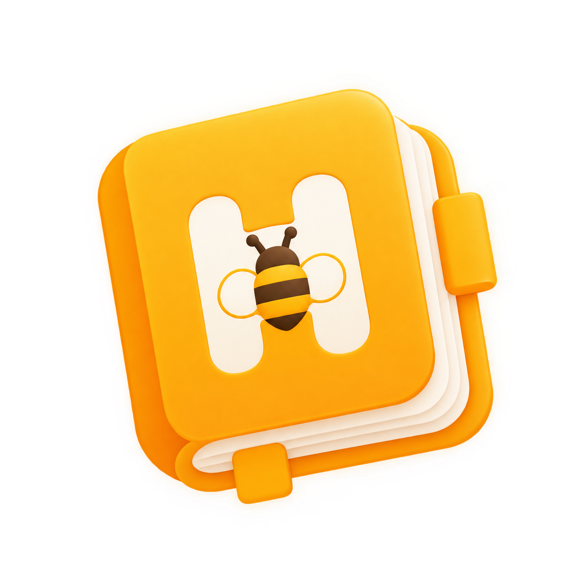

<p align="center">
  
</p>

<h1 align="center">Honeyday</h1>

<p align="center">
  
  
  
  
  
</p>

<p align="center">
  <strong>Digital agenda & journal app with freehand ink, modular widgets, and a warm paper aesthetic.</strong>
</p>

<p align="center">
  Built with Flutter — Multiplatform (Android, iOS, Web, Linux, macOS, Windows)
</p>

---

## Features

- **Multi-agenda management** — Create, organize, and switch between multiple agendas with custom covers and paper styles.
- **Freehand ink engine** — Write, draw, and highlight with pressure-sensitive vector strokes (pen, highlighter, eraser).
- **Modular canvas widgets** — Drop shapes, planner templates, stickers, calendars, budget trackers, and more onto your pages.
- **Three interaction modes** — Reading (flip pages), Writing (ink drawing), Edit (drag, resize, rotate widgets).
- **Customizable themes** — Light/dark mode, 8 accent color presets, warm paper-and-honey aesthetic.
- **Onboarding flow** — Clean 3-step onboarding carousel.
- **Offline-first** — Local SQLite persistence via Drift with cloud-ready sync architecture.
- **Responsive layout** — Adaptive navigation (bottom bar on mobile, rail on desktop).

## Tech Stack

| Layer | Technology |
|---|---|
| Framework | [Flutter](https://flutter.dev) 3.x |
| State Management | [Riverpod](https://riverpod.dev) |
| Routing | [GoRouter](https://pub.dev/packages/go_router) |
| Local Database | [Drift](https://drift.simonbinder.eu) (SQLite) |
| Fonts | [Google Fonts](https://fonts.google.com) (Fraunces + Plus Jakarta Sans) |
| Animations | [flutter_animate](https://pub.dev/packages/flutter_animate) |
| Ink Engine | [perfect_freehand](https://pub.dev/packages/perfect_freehand) |
| Linting | [Very Good Analysis](https://pub.dev/packages/very_good_analysis) |

## Project Structure

```
lib/
├── app/                    # App shell, router, theme
│   ├── app.dart            # Root widget, providers
│   ├── app_shell.dart      # Navigation scaffold
│   ├── router.dart         # GoRouter config
│   └── theme.dart          # Material 3 themes
├── core/                   # Shared infrastructure
│   ├── accessibility/      # Semantic widgets
│   ├── database/           # Drift schema & providers
│   └── theme/              # Colors, paper styles
├── features/               # Feature modules (domain / data / presentation)
│   ├── agendas/            # Agenda CRUD & viewer
│   ├── canvas/             # Ink canvas, transform engine, snapping
│   ├── catalog/            # Widget registry & modular elements
│   ├── onboarding/         # First-launch flow
│   └── settings/           # Preferences & appearance
└── main.dart               # Entry point
```

## Getting Started

### Prerequisites

- [Flutter SDK](https://flutter.dev/docs/get-started/install) (3.x, channel stable)
- Dart SDK (bundled with Flutter)

### Installation

```bash
# Clone the repository
git clone https://github.com/lamonega/honeyday.git
cd honeyday

# Install dependencies
flutter pub get

# Run code generation (Drift)
dart run build_runner build --delete-conflicting-outputs

# Launch the app
flutter run
```

### Running Tests

```bash
flutter test
```

## Contributing

Contributions are welcome! Please read the [Contributing Guide](CONTRIBUTING.md) before submitting a PR.

## License

This project is licensed under the **GNU General Public License v3.0** — see the [LICENSE](LICENSE) file for details.

---

<p align="center">
  Made with care by <a href="https://github.com/lamonega">lamonega</a>
</p>
